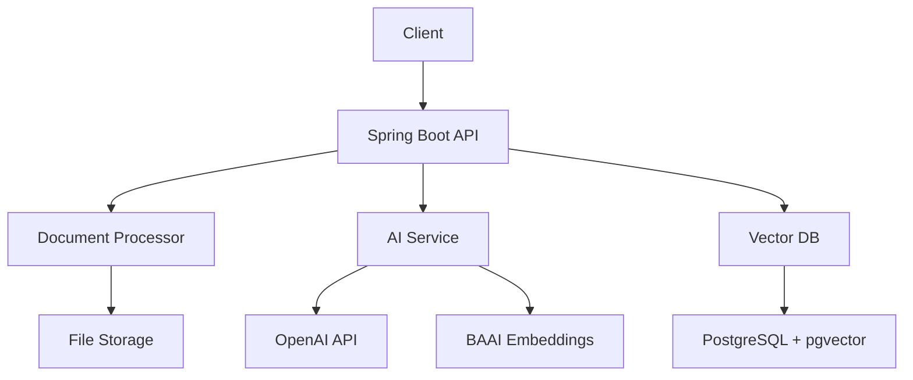

# InsightLens Technical Implementation Guide

## 🏗️ System Architecture

### Backend Architecture


## 💻 Core Components

### 1. Document Processing Pipeline

#### Document Model
```java
@Entity
@Table(name = "documents")
public class Document {
    @Id
    @GeneratedValue(strategy = GenerationType.IDENTITY)
    private Long id;
    
    private String filename;
    private String originalFilename;
    private String fileType;
    private Long fileSize;
    private String filePath;
    
    @Enumerated(EnumType.STRING)
    private DocumentStatus status;
    
    private String domainType;
    private Integer version = 1;
    
    @OneToMany(mappedBy = "document", cascade = CascadeType.ALL)
    private List<DocumentSection> sections;
    
    // ... other fields
}
```

#### Document Section Model
```java
@Entity
@Table(name = "document_sections")
public class DocumentSection {
    @Id
    @GeneratedValue(strategy = GenerationType.IDENTITY)
    private Long id;
    
    @ManyToOne
    private Document document;
    
    private String text;
    
    @Column(columnDefinition = "vector(384)")
    private float[] embedding;
    
    private String sectionType;
    private Integer sectionOrder;
}
```

### 2. AI Integration

#### Embedding Generation
```java
@Service
public class EmbeddingService {
    private final SentenceTransformer model;
    
    public EmbeddingService() {
        this.model = SentenceTransformer("BAAI/bge-small-en-v1.5");
    }
    
    public float[] generateEmbedding(String text) {
        return model.encode(text);
    }
}
```

#### Document Comparison
```java
@Service
public class DocumentComparisonService {
    private final OpenAIClient openAIClient;
    
    public ComparisonResult compareDocuments(Document doc1, Document doc2) {
        // 1. Match sections using embeddings
        List<SectionPair> matchedSections = matchSections(doc1, doc2);
        
        // 2. Generate insights using GPT-4
        String prompt = buildComparisonPrompt(matchedSections);
        String analysis = openAIClient.generateAnalysis(prompt);
        
        // 3. Structure and return results
        return new ComparisonResult(matchedSections, analysis);
    }
}
```

### 3. Frontend Components

#### Document Viewer
```jsx
const DocumentViewer = ({ document }) => {
  const [selectedText, setSelectedText] = useState(null);
  const [suggestions, setSuggestions] = useState([]);

  const handleTextSelection = async (text) => {
    setSelectedText(text);
    const insights = await fetchInsights(text);
    setSuggestions(insights);
  };

  return (
    <div className="document-viewer">
      <div className="content" onMouseUp={handleTextSelection}>
        {document.content}
      </div>
      {selectedText && (
        <InsightPopup
          text={selectedText}
          suggestions={suggestions}
          onAction={handleInsightAction}
        />
      )}
    </div>
  );
};
```

#### Comparison Interface
```jsx
const DocumentComparison = ({ doc1, doc2 }) => {
  const [comparison, setComparison] = useState(null);

  useEffect(() => {
    const fetchComparison = async () => {
      const result = await compareDocuments(doc1.id, doc2.id);
      setComparison(result);
    };
    fetchComparison();
  }, [doc1, doc2]);

  return (
    <div className="comparison-view">
      <div className="doc1">
        <DocumentViewer document={doc1} />
      </div>
      <div className="doc2">
        <DocumentViewer document={doc2} />
      </div>
      <div className="insights-panel">
        {comparison?.insights.map(insight => (
          <InsightCard key={insight.id} insight={insight} />
        ))}
      </div>
    </div>
  );
};
```

## 🔧 API Endpoints

### GraphQL Schema
```graphql
type Query {
  documentsByStatus(status: String!): [Document!]!
  getDocumentById(id: ID!): Document
  compareDocuments(docIdA: ID!, docIdB: ID!): ComparisonResult
}

type Mutation {
  uploadDocument(file: Upload!): Document!
  processDocument(id: ID!): Document!
}

type Document {
  id: ID!
  filename: String!
  originalFilename: String!
  fileType: String!
  fileSize: Int!
  status: String!
  domainType: String
  sections: [DocumentSection!]!
}

type DocumentSection {
  id: ID!
  text: String!
  sectionType: String!
  sectionOrder: Int!
}

type ComparisonResult {
  matchedSections: [SectionPair!]!
  insights: [Insight!]!
}

type SectionPair {
  sectionA: DocumentSection!
  sectionB: DocumentSection!
  similarity: Float!
}

type Insight {
  id: ID!
  type: String!
  description: String!
  impact: String
  recommendations: [String!]
}
```

## 🚀 Deployment

### Backend (Spring Boot)
```yaml
# application.yml
spring:
  datasource:
    url: jdbc:postgresql://localhost:5432/insightlens
    username: ${DB_USERNAME}
    password: ${DB_PASSWORD}
  
  jpa:
    properties:
      hibernate:
        dialect: org.hibernate.dialect.PostgreSQLDialect
  
  servlet:
    multipart:
      max-file-size: 50MB
      max-request-size: 50MB

dgs:
  graphql:
    path: /graphql
    enabled: true
    csrf:
      enabled: false

openai:
  api-key: ${OPENAI_API_KEY}
  model: gpt-4-turbo-preview
```

### Frontend (Vite + React)
```javascript
// vite.config.js
export default defineConfig({
  server: {
    proxy: {
      '/graphql': {
        target: 'http://localhost:8080',
        changeOrigin: true
      }
    }
  }
});
```

## 📊 Database Schema

### PostgreSQL Tables
```sql
-- Documents table
CREATE TABLE documents (
    id SERIAL PRIMARY KEY,
    filename VARCHAR(255) NOT NULL,
    original_filename VARCHAR(255) NOT NULL,
    file_type VARCHAR(50) NOT NULL,
    file_size BIGINT NOT NULL,
    file_path VARCHAR(255) NOT NULL,
    status VARCHAR(50) NOT NULL,
    domain_type VARCHAR(50),
    version INTEGER DEFAULT 1,
    created_at TIMESTAMP DEFAULT CURRENT_TIMESTAMP,
    updated_at TIMESTAMP DEFAULT CURRENT_TIMESTAMP
);

-- Document sections table with vector support
CREATE TABLE document_sections (
    id SERIAL PRIMARY KEY,
    document_id INTEGER REFERENCES documents(id),
    text TEXT NOT NULL,
    embedding vector(384),
    section_type VARCHAR(50),
    section_order INTEGER,
    created_at TIMESTAMP DEFAULT CURRENT_TIMESTAMP
);

-- Create indexes
CREATE INDEX idx_document_status ON documents(status);
CREATE INDEX idx_document_domain ON documents(domain_type);
CREATE INDEX idx_section_embedding ON document_sections USING ivfflat (embedding vector_cosine_ops);
```

## 🔒 Security Considerations

1. **Document Encryption**
   - Encrypt files at rest
   - Use secure file paths
   - Implement access control

2. **API Security**
   - JWT authentication
   - Rate limiting
   - CORS configuration

3. **Data Protection**
   - PII detection and masking
   - Audit logging
   - Data retention policies

## 📈 Performance Optimization

1. **Caching Strategy**
   - Redis for embeddings
   - CDN for static assets
   - Browser caching

2. **Query Optimization**
   - Indexed vector searches
   - Pagination
   - Lazy loading

3. **Async Processing**
   - Background jobs for heavy tasks
   - WebSocket for real-time updates
   - Queue system for document processing 